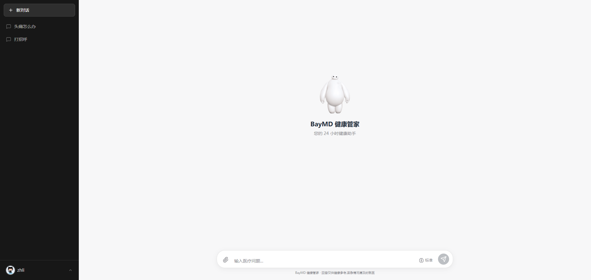
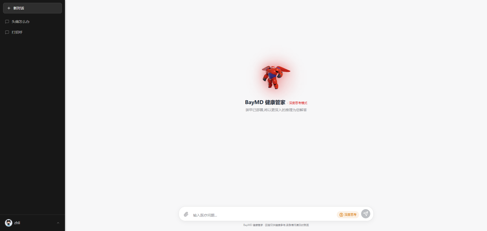
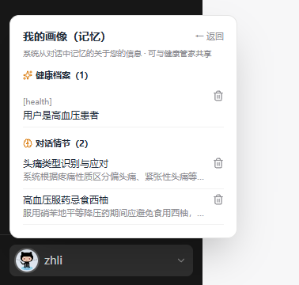
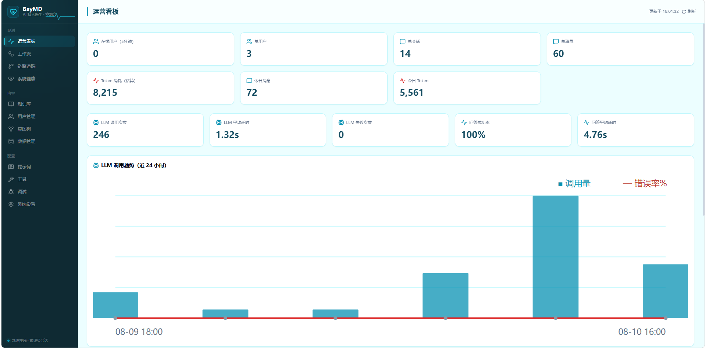
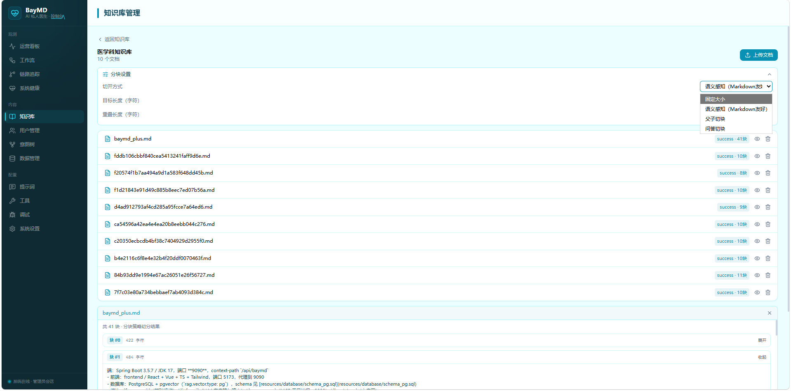
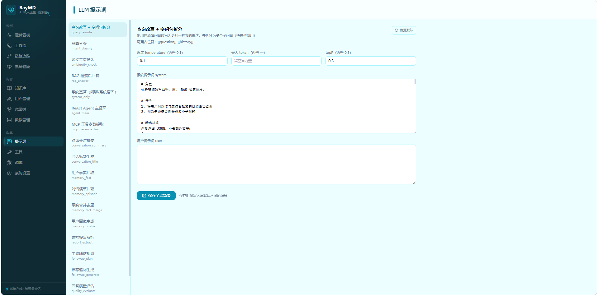
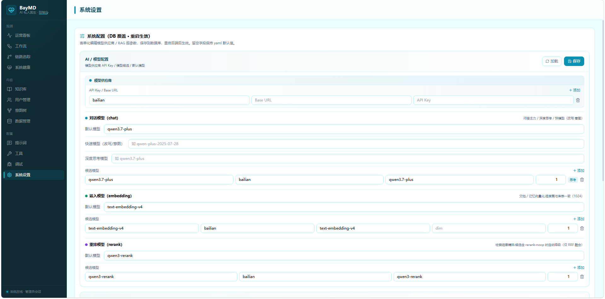
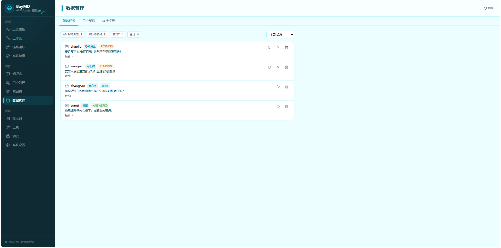

# BayMD — AI 健康管家

> 基于 ReAct Agent + 渐进式记忆系统的医学健康智能问答平台,**越用越聪明**。

[](https://github.com/zhli103/baymd/actions/workflows/ci.yml)

## 🎬 演示视频

[▶ 点击观看 BayMD 功能演示(B 站)](https://www.bilibili.com/video/BV1yJu16bEpV)

## 📸 界面预览

### 用户端

| 普通模型对话 | 深度思考展示 |
|---|---|
|  |  |

| 修改用户画像 |
|---|
|  |

### 管理后台

| 运营看板 | 知识库 |
|---|---|
|  |  |

| 提示词配置 | 系统设置 |
|---|---|
|  |  |

| 数据管理(随访 / 反馈 / 报告) |
|---|
|  |

---

## 🚀 快速开始(Docker 一键部署)

只需要 **Docker + Compose**,一条命令启动全部服务(数据库 / Redis / RocketMQ / 对象存储 / 后端 / 前端 / MCP Server)。

### 环境要求

| 项目 | 要求 |
|------|------|
| Docker | ≥ 20.10(支持 Compose v2) |
| 内存 | ≥ 4 GB(默认 pgvector 方案,无需 Milvus) |
| 网络 | 可访问 Docker Hub 与阿里云百炼 API |

### 部署步骤

```bash
# 1. 克隆项目
git clone https://github.com/zhli103/baymd.git && cd baymd

# 2. (可选)配置自己的 API Key — 不配置则使用内置 key
cp .env.example .env
#   编辑 .env: BAILIAN_API_KEY=sk-xxx   (阿里云百炼,https://bailian.console.aliyun.com/)

# 3. 构建并启动(首次构建需 5~10 分钟)
docker compose up -d --build
```

### 验证部署

| 服务 | 地址 | 说明 |
|------|------|------|
| 用户端 | http://localhost | ChatGPT 风格对话界面 |
| 管理后台 | http://localhost/admin | 运营看板 / 知识库 / 用户管理 / 意图树等(账号 `admin` / `admin123456`) |
| 后端 API | http://localhost:9090/api/baymd | OpenAPI 风格 REST + SSE 流式 |
| MCP Server | http://localhost:9099 | MCP 工具服务(可注册任意工具) |

```bash
# 健康检查
curl http://localhost:9090/api/baymd/rag/settings

# 发起问答
curl --get "http://localhost:9090/api/baymd/rag/v3/chat" \
  --data-urlencode "question=头疼挂什么科"
```

### 常用运维命令

```bash
docker compose logs -f baymd-backend   # 查看后端日志
docker compose down                    # 停止(数据保留)
docker compose down -v                 # 停止并清空全部数据(重置环境)
docker compose up -d --build           # 更新后重新构建
```

### 高级选项

- **使用 Milvus 向量库**(内存要求更高):`docker compose --profile milvus up -d`,并将 `bootstrap/src/main/resources/application.yaml` 中 `rag.vector.type` 改为 `milvus` 后重建镜像。
- **内存受限服务器**:默认 pgvector 方案约需 2~3 GB,可参考 `resources/docker/lightweight/` 的降配配置。
- **邮件随访**:在 `.env` 配置 `MAIL_USERNAME` / `MAIL_PASSWORD`(QQ/163 用授权码),并在 `application.yaml` 开启 `rag.followup.enabled=true`。

---

## ✨ 核心亮点

### 🤖 ReAct Agent 自主推理
LLM 自主决策:思考 → 工具调用 → 观察结果 → 循环,最大 10 轮迭代。知识库检索和 MCP 工具平等对待,Agent 自主选择调用时机。

```
用户: 头疼和发烧分别怎么办
Agent: 思考 → search_knowledge_base("头疼") → 观察结果
     → search_knowledge_base("发烧") → 观察结果
     → 综合分析 → 最终回答
```

### 🧠 渐进式记忆系统(借鉴 EverOS)
三级记忆架构,越用越了解用户:

| 层级 | 策略 | 说明 |
|------|------|------|
| 短时 | sliding_window | 滑动窗口保留最近 N 轮原文 |
| 长时 | summary_compression | 超阈值自动 LLM 摘要压缩 |
| 语义 | semantic | 异步抽取 Fact + Episode → 向量化 → HNSW 检索 → 注入 Prompt |

**记忆生命周期**:
```
对话结束 → LLM 提取 AtomicFact(原子事实)+ Episode(情节摘要)
→ SHA-256 去重 → pgvector 向量化入库
→ 下次对话 → 语义检索相关记忆 → 注入 Prompt

累积 10+ 同类型 Fact → LLM 自动合并去重
累积 30+ Fact → 自动生成用户健康画像
```

配置切换:`rag.memory.strategy: semantic`

### 🎯 7 大医学场景

| 场景 | 说明 |
|------|------|
| 科室推荐 | 根据症状推荐就诊科室 |
| 症状自查 | 症状病因分析与就医建议 |
| 药物查询 | 功效、用法、副作用、禁忌 |
| 饮食建议 | 慢病饮食、营养指导 |
| 中医辨证 | 体质辨识、中医食疗 |
| 报告解读 | 血常规、生化指标分析 |
| 医院推荐 | 医院等级与专科推荐 |

### 🔍 多通道混合检索

向量全局检索 + 意图定向检索并行 → **RRF 倒序排名融合**(k=60)→ Rerank 精排 → 证据预算截断

### 🛡️ 生产级护栏

- **紧急分诊短路**:红旗症状(胸痛/呼吸困难/意识不清/自杀自残等 74+ 关键词 8 类)在预处理最前端零成本检测,`EmergencyExecutor` 跳过检索/Agent 直接输出急救指引 + 心理援助热线(前端红色警示卡)
- **工具调用**:指数退避重试 + 超时 + 降级(RetrievalEngine/MCP 全覆盖)
- **证据预算**:Token 预算控制 + 低置信度短路
- **Checkpoint**:Redis 持久化,支持中断恢复
- **模型路由**:三状态断路器(CLOSED → OPEN → HALF_OPEN),故障自动切换

### 🧰 Agent 医学工具

ReAct 框架内置可调用的领域工具(`@Component` 即自动注册):

| 工具 | 能力 |
|------|------|
| `medical_calculator` | BMI / eGFR(CKD-EPI 2021) / BSA(Mosteller) / 最大心率,含临床解读 |
| `drug_interaction` | 55 组药物相互作用双向查询,未收录不编造 |
| `create_followup_reminder` | 对话中直接创建随访提醒任务 |
| `query_report_indicator` | 查询历史报告指标,支持时间对比("血糖比上次高吗") |

### 🏥 报告解读入口

上传化验单/检查单图片或 PDF → **Tika 文本层 / qwen-vl 多模态分流** → LLM 结构化提取指标(name/value/unit/refRange/flag)→ 注入对话上下文,支持"这份报告有什么问题""我的血糖比上次高吗"等追问。

### ✉️ 主动随访(邮件推送)

对话结束后 LLM 判断是否值得随访 → 生成 PENDING 任务(主题 7 天去重 / 每日限 1 / 静默时段顺延 / 3 天过期)→ 定时调度发送邮件(**正文不含病情细节**,隐私红线)→ 深链回流预填问题 → 用户回答自动写回语义记忆,形成"越用越聪明"闭环。通知通道为 SPI 可插拔(预留短信/微信)。

### 🎨 双端 Web 界面

**用户端**(ChatGPT 风格,炭黑 + 暖白配色):
- SSE 流式对话 + 深度思考展示 + 大白(Baymax)跟随鼠标互动
- 会话管理(新建/切换/删除/导出)、引用来源折叠卡片、推荐追问
- 注册/登录(支持用户名或邮箱)、头像上传、修改密码
- 我的画像:查看/删除个人记忆(Fact + Episode)
- 报告上传解读、点赞/踩反馈

**管理后台**(医疗监护风格,青蓝配色):
- 运营看板(请求量/模型健康/LLM 统计/错误率)、RAG 工作流可视化、链路追踪
- 知识库管理(上传/分块/索引)、意图树管理、RAG 调试面板
- 用户管理(增删改查 + 记忆画像)、数据管理(随访任务/用户反馈/体检报告)
- 场景化提示词配置(每个 LLM 调用点可调 system/user 提示词 + 温度等超参)
- 工具/MCP Server 管理、系统健康检查、系统设置

### 📄 其他基础设施

- **文档摄取 DAG**:6 节点可编排流水线,支持 PDF/DOCX/HTML/MD
- **查询改写 + 子问题拆分**:LLM 改写 + Jaccard 去重 + 自包含增强 + 质量评分
- **LLM-as-Judge**:异步四维质量评分(准确度/完整度/忠实度/简洁度)
- **反馈联动**:点踩自动降级关联 Fact,持续踩自动清理
- **分布式公平队列限流**:Redis ZSET + Lua 原子脚本 + 信号量 + Pub/Sub

---

## 🛠 手动部署(开发模式)

### 1. 启动依赖服务

```bash
# PostgreSQL(pgvector 扩展)+ Redis + RocketMQ + MinIO 兼容对象存储
docker compose up -d postgres redis rmqnamesrv rmqbroker rustfs
```

### 2. 初始化数据库

```bash
psql -h localhost -U postgres -d baymd -f resources/database/schema_pg.sql
psql -h localhost -U postgres -d baymd -f resources/database/init_feature_tables.sql   # 新功能表(幂等)
psql -h localhost -U postgres -d baymd -f resources/database/init_drug_interaction.sql # 药物种子数据(幂等)
psql -h localhost -U postgres -d baymd -f resources/database/init_medical_kb.sql       # 医学知识库种子
```

### 3. 配置 API Key

默认使用 `bootstrap/src/main/resources/application.yaml` 内置 key,也可用环境变量覆盖:

```bash
export BAILIAN_API_KEY=your_key_here
```

### 4. 启动后端(端口 9090)

```bash
./mvnw spring-boot:run -pl bootstrap
```

### 5. 启动 MCP Server(端口 9099,可选)

```bash
./mvnw spring-boot:run -pl mcp-server
```

### 6. 启动前端(端口 5173,代理到 9090)

```bash
cd frontend && npm install && npm run dev
```

> **功能开关**:报告解读(`rag.report.enabled`)、主动随访(`rag.followup.enabled` + SMTP 配置)、视觉模型(`ai.vision`)默认关闭,按需开启后重启后端。

---

## 对话管线

```
Emergency Detect (关键词短路) → Memory Load → Query Rewrite → Intent Classification
→ ExecutorRegistry 分发 (枚举声明顺序即优先级):
    ├── EMERGENCY         (红旗症状 → 急救指引,零检索延迟)
    ├── ClarificationExecutor   (歧义引导)
    ├── SystemOnlyExecutor      (闲聊/问候,不走检索)
    ├── AgentExecutor           (ReAct 循环,rag.react.enabled=true)
    └── RagExecutor             (经典 RAG,兜底)
```

## 项目结构

| 模块 | 说明 |
|------|------|
| `framework` | 基础设施:分布式限流、AOP、上下文传递、通用工具 |
| `infra-ai` | AI 基础设施:Chat/Embedding/Rerank 客户端、模型路由、断路器、健康检查 |
| `mcp-server` | MCP 工具服务:独立进程,可注册任意工具 |
| `bootstrap` | 应用核心:RAG 管线、Agent、记忆系统、意图树、API |
| `frontend` | React 前端(用户端 + 管理后台,Vite + Tailwind CSS) |
| `resources/` | 数据库脚本、Docker 部署配置、默认提示词模板 |
| `docker/` | Docker 部署配套(nginx 配置、数据库初始化脚本) |

## 技术栈

| 层级 | 技术 |
|------|------|
| 语言 | JDK 17 / TypeScript |
| 框架 | Spring Boot 3.5.7 / React + Vite |
| 数据库 | PostgreSQL + pgvector (HNSW) |
| 向量库 | Milvus 2.6.6(可选,默认 pgvector) |
| 缓存 | Redisson 4.0 |
| 消息 | RocketMQ |
| 文档解析 | Apache Tika 3.2.3 |
| 认证 | Sa-Token 1.43.0 |
| MCP | MCP SDK 1.1.2 |
| 存储 | AWS S3 / MinIO 兼容(rustfs) |
| CI | GitHub Actions |

## 配置说明(环境变量)

| 变量 | 默认值 | 说明 |
|------|--------|------|
| `BAILIAN_API_KEY` | 内置 key | 阿里云百炼 API Key |
| `SPRING_DATASOURCE_URL` | `jdbc:postgresql://127.0.0.1:5432/baymd` | PostgreSQL 连接 |
| `SPRING_DATA_REDIS_HOST` / `PORT` / `PASSWORD` | `127.0.0.1:6379` / `123456` | Redis 连接 |
| `ROCKETMQ_NAME_SERVER` | `127.0.0.1:9876` | RocketMQ NameServer |
| `MILVUS_URI` | `http://localhost:19530` | Milvus 地址(切向量库时用) |
| `RUSTFS_URL` / `S3_ENDPOINT` | `http://localhost:9000` | 对象存储(报告文件) |
| `MCP_SERVER_URL` | `http://localhost:9099` | 本地 MCP Server |
| `MAIL_HOST` / `USERNAME` / `PASSWORD` | — | 随访邮件 SMTP(授权码) |
| `WEB_PORT` | `80` | 前端对外端口(docker compose) |

## API 一览

```
# 对话
GET  /rag/v3/chat              SSE 流式问答
POST /rag/v3/stop              停止任务

# 会话
GET    /conversations            列表
PUT    /conversations/{id}       重命名
DELETE /conversations/{id}       删除
GET    /conversations/{id}/messages  消息列表
GET    /conversations/{id}/export    导出 JSON
DELETE /memory                   清空记忆

# 反馈
POST /conversations/messages/{id}/feedback  点赞/踩 → 联动 Fact

# 报告解读
POST /rag/report/upload      上传报告(multipart: jpg/png/pdf)
GET  /rag/report/{id}        报告详情
GET  /rag/v3/chat?reportId=  对话携带报告上下文

# 主动随访
GET  /followup/list              我的随访任务
GET  /followup/{id}              深链取随访问题
POST /followup/{id}/answered     标记已答
GET  /followup/unsubscribe?token 免登录退订
POST /user/email/bind            发送邮箱验证码
POST /user/email/verify          验证并绑定邮箱

# 用户
POST   /auth/login                登录(用户名或邮箱)
POST   /user/auth/register        注册(必填邮箱)
GET    /user/me                   当前用户信息
POST   /user/avatar               头像上传

# 知识库
POST   /knowledge-base               创建
GET    /knowledge-base               列表
DELETE /knowledge-base/{id}          删除
POST   /knowledge-base/{id}/docs/upload  上传文档
GET    /knowledge-base/{id}/docs         文档列表

# 系统
GET /rag/settings         配置
GET /rag/traces/runs      Trace 链路
GET /admin/ops/overview   运营看板
```

## FAQ

**Q: 忘记管理员密码怎么办?**
A: 直接改数据库:`UPDATE t_user SET password = '新密码' WHERE username = 'admin';` 后重启后端。

**Q: 服务器内存只有 2GB 能跑吗?**
A: 可以但紧张。建议:不用 Milvus(默认 pgvector)、降低 RocketMQ 内存(`docker-compose.yml` 中 `JAVA_OPT_EXT`),参考 `resources/docker/lightweight/`。

**Q: 知识库检索不到内容?**
A: 上传文档后需等待摄取流水线完成(日志可观察);确认 `rag.vector.type` 与实际部署的向量库一致;可在管理后台「调试」面板查看检索链路。

**Q: 公网 IP 变了前端打不开?**
A: 前端走相对路径 `/api`,不依赖 IP 配置;如用 Vite dev 模式需同步修改 `vite.config.ts` 代理地址。

## License
